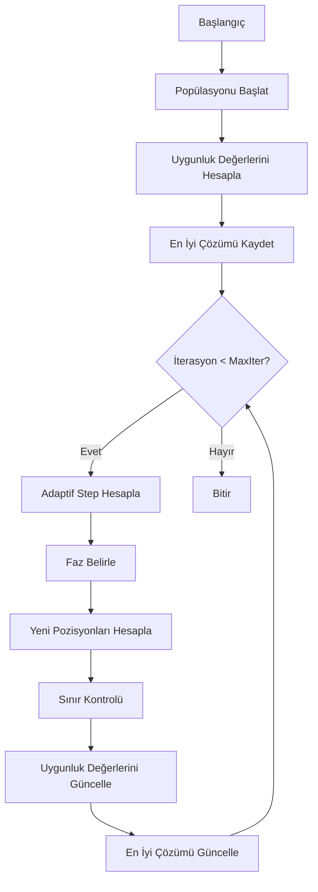

# Marine Predators Algorithm (MPA) Detaylı Analiz

## 1. Algoritmanın Mantığı ve İlham Kaynağı

Marine Predators Algorithm (MPA), 2020 yılında Afshin Faramarzi ve arkadaşları tarafından önerilen, deniz avcılarının av arama ve yakalama stratejilerinden esinlenen bir meta-sezgisel optimizasyon algoritmasıdır. Algoritma, özellikle deniz ortamındaki avcı-av ilişkisini ve Lévy ve Brownian hareketlerini temel alır.

### 1.1 Temel Biyolojik İlham
- Deniz avcıları, optimal av arama stratejilerini kullanarak enerji verimliliğini maksimize eder
- Avcılar ve avlar arasındaki etkileşim, çevresel koşullara göre sürekli evrimleşir
- Arama stratejileri, avın yoğunluğuna bağlı olarak değişir:
  * Düşük av yoğunluğunda: Lévy hareketi (uzun mesafeli aramalar)
  * Yüksek av yoğunluğunda: Brownian hareketi (kısa mesafeli aramalar)

## 2. Matematiksel Model ve Eşitlikler

### 2.1 Adaptif Hız Vektörü
```math
Step = P * (1 - t/T)
```
Burada:
- P: Maksimum adım boyutu
- t: Mevcut iterasyon
- T: Maksimum iterasyon sayısı

### 2.2 Arama Fazı Eşitlikleri

#### Faz I (İlk %10 iterasyon):
```math
X_next = X_best + R_B ⊗ (X_best - X + Step ⊗ B)
```

#### Faz II (%10-%50 iterasyon):
```math
X_next = X_best + R_B ⊗ (R_B ⊗ (X_best - X + Step ⊗ B))
```

#### Faz III (%50-%75 iterasyon):
```math
X_next = Step ⊗ L ⊗ CF
```

#### Faz IV (Son %25 iterasyon):
```math
X_next = X_elite - CF ⊗ (R_B ⊗ Step ⊗ B ⊗ (X_elite - X))
```

Burada:
- X_best: En iyi çözüm
- R_B: Rasgele sayı [0,1]
- B: Brownian hareketi vektörü
- L: Lévy hareketi vektörü
- CF: Adaptif dönüşüm faktörü
- ⊗: Eleman bazlı çarpım

### 2.3 Lévy Uçuşu
```math
Lévy(x) = 0.01 × \frac{u × σ}{|v|^{1/β}}
```
Burada:
- β = 1.5 (Lévy indeksi)
- σ: Lévy dağılımı için ölçek faktörü
- u, v: Normal dağılımdan örneklenen sayılar

## 3. Algoritma Akış Şeması



## 4. Kod Açıklaması

```python
def optimize(self):
    # Popülasyonu başlat
    prey = self.lb + (self.ub - self.lb) * rand(self.n_particles, self.dim)
    fitness = np.zeros(self.n_particles)
```
Bu kısım, arama uzayında rasgele pozisyonlarda başlangıç popülasyonunu oluşturur.

```python
# Adaptif step size
step_size = (1 - t/self.max_iter) * 0.5
```
İterasyonlar ilerledikçe adım boyutunu azaltan adaptif bir faktör hesaplar.

```python
# Phase 1: Brownian motion
if rand() < 0.5:
    R = randn()
    new_position = self.best_solution + R * step_size * randn(self.dim)
```
Brownian hareketi ile yerel arama gerçekleştirir. Rasgele adımlarla mevcut en iyi çözüm etrafında arama yapar.

```python
# Phase 2: Levy flight
beta = 1.5  # Levy component
sigma = (math.gamma(1 + beta) * math.sin(math.pi * beta / 2) / 
        (math.gamma((1 + beta) / 2) * beta * 2 ** ((beta - 1) / 2))) ** (1 / beta)
```
Lévy uçuşu parametrelerini hesaplar. Bu hareket, uzun mesafeli aramaları mümkün kılar.

## 5. Algoritmanın Güçlü ve Zayıf Yönleri

### Güçlü Yönleri:
- Adaptif arama stratejisi
- Dengeli global ve yerel arama yeteneği
- Farklı problem tiplerine uyarlanabilirlik
- Arama fazlarının etkili geçişi

### Zayıf Yönleri:
- Hesaplama karmaşıklığı görece yüksek
- Parametre ayarları hassas
- Yüksek boyutlu problemlerde yavaşlama

## 6. Uygulama Alanları

1. Mühendislik Tasarım Optimizasyonu
2. Parametre Ayarlama
3. Yörünge Optimizasyonu
4. Yapay Sinir Ağları Eğitimi
5. Görev Planlama ve Çizelgeleme

## 7. Performans Özellikleri

- Keşif (Exploration) Yeteneği: Lévy uçuşu sayesinde yüksek
- Sömürü (Exploitation) Yeteneği: Brownian hareketi ile etkili
- Yakınsama Hızı: Orta-Yüksek
- Yerel Minimumlardan Kaçınma: İyi
- Parametre Hassasiyeti: Orta

## 8. Sonuç

Marine Predators Algorithm, doğadan esinlenen modern bir optimizasyon algoritmasıdır. Deniz avcılarının av arama stratejilerini modelleyerek, etkili bir global optimizasyon yaklaşımı sunar. Adaptif arama mekanizması ve farklı hareket stratejilerinin kombinasyonu sayesinde, çeşitli optimizasyon problemlerinde başarılı sonuçlar elde edebilir.